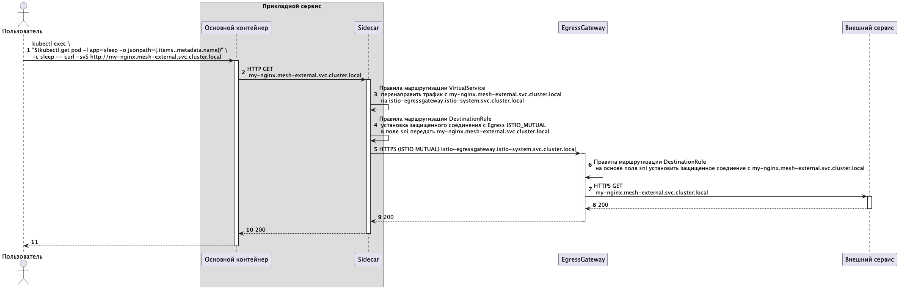

Для правильной работы необходимо настроить правила передачи запросов на указанных ранее участках.

Правила передачи запросов в istio состоят из двух частей: 

* маршрутизация и преобразование входящего запроса в envoy proxy (Sidecar или Gateway)
* маршрутизация и преобразование результирующего исходящего запроса из envoy proxy (Sidecar или Gateway)

Инструкции для таких прeобразований формируются при помощи объектов VirtualService и Destination Rule:

* VirtualService - для входящих запросов
* DestinationRule - для исходяших запросов

Также предварительно потребуется настроить объект Gateway, который определяет базовые свойства шлюза и делает его доступным для использования в других объектах Istio

