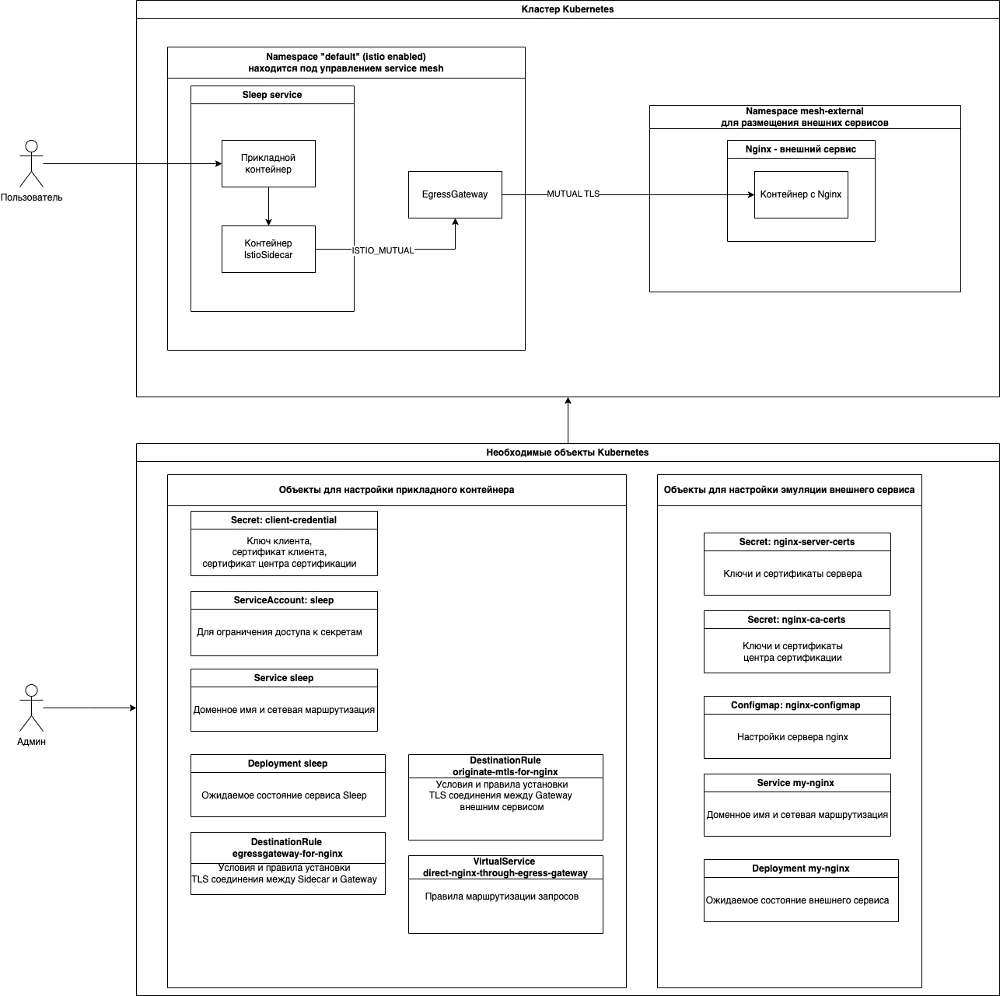

Для решения задачи вам будет необходимо:

1. Создать необходимые объекты Kubernetes для запуска экземпляра внешнего сервиса
1. Создать необходимые объекты Kubernetes для запуска прикладного сервиса под управлением Istio Service Mesh
1. Убедиться, что внешний сервис недоступен из прикладного сервиса
1. Создать дополнительные объекты конфигурации для настройки доступа из прикладного сервиса к внешнему сервису
1. Убедиться, что внешний сервис стал доступен из прикладного сервиса

## Описание архитектуры задания

В задании используются 2 Kubernetes Namespace (default и mesh-external)

* **default** - этот Namespace будет находится под управлением ServiceMesh, и в нем будет расположен прикладной сервис
* **mesh-external** - этот Namespace не будет управляться при помощи ServiceMesh и выступает в роли внешней сети по отношению к default

В качестве внешнего сервиса будет использоваться web сервер Nginx,  расположенный в Namespace mesh-external

Прикладной сервис представляет собой контейнер с опреационной системой Ubuntu c уставленной утилитой curl, при помощи которой вы сможете выполнить запрос к внешнему сервису. 

## Схема архитектуры задания

