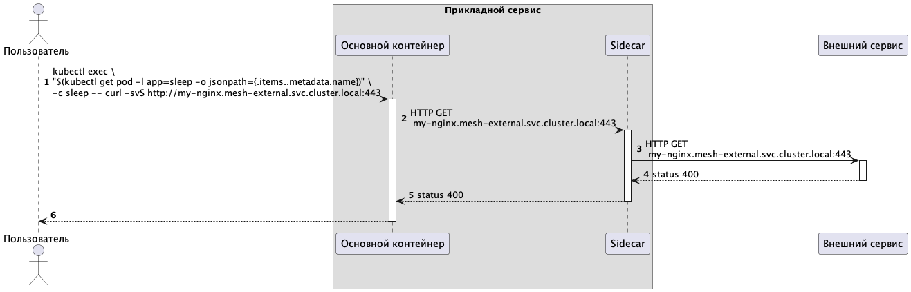

Проверим связь между прикладным контейнером и внешним сервисом. Для этого выполните команду.

```
kubectl exec \
"$(kubectl get pod -l app=sleep -o jsonpath={.items..metadata.name})" \
-c sleep -- curl -svS http://my-nginx.mesh-external.svc.cluster.local:443
```{{execute}}

Результат выполнения команды в терминале должен содержать такую информацию 

```
...
< HTTP/1.1 400 Bad Request
...
```

Очевидно, что конфигурация нуждается в доработке, тк внешний сервис не понимает наш запрос.

## Что происходит?

Последовательность взаимодействий показана на рисунке



Описание взаимодействий 
1. отправка команды в кластер Кубера для выполнения http запроса к внешнему сервису при помощи команды curl
1. запрос от контейнера направляется в Sidecar
1. Sidecar перенаправлет запрос во внешний сервис
1. внешний сервис отвечает со статусом 400
1. сайдкар возвращает статус 400 в прикладной сервис


