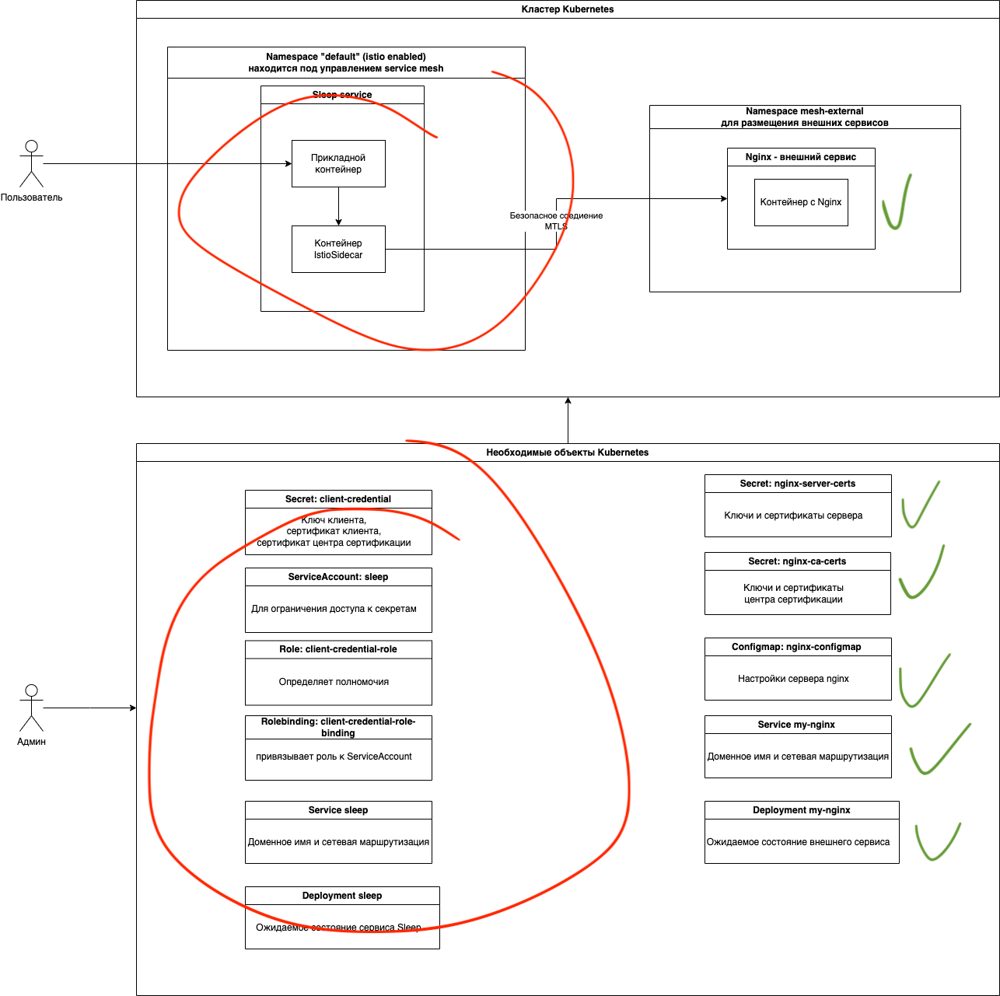

Вы только что завершили настройку внешнего сервиса (на схеме ниже проделанная работа обозначена зелеными галочками)

Теперь вам необходимо будет настроить внутренний прикладной сервис и его свзять по защищенному MTLS каналу с внешним сервисом. 

Перейдите к следующему шагу и приступим :)

